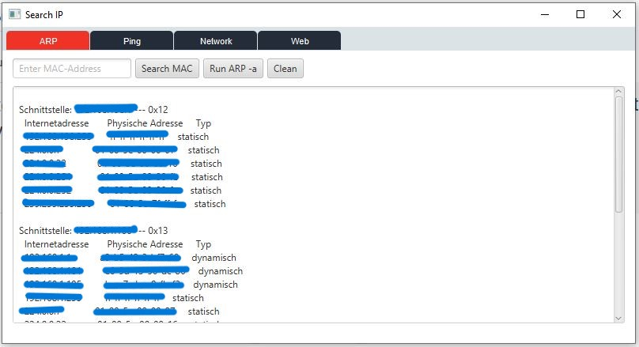
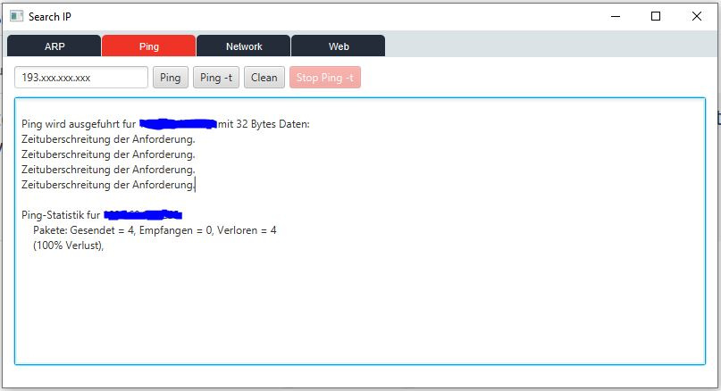

### In development
## Search IP

The **Search IP** program is designed to simplify
the process of finding **IP** addresses without using the command line (**CMD**).
This tool enables convenient management of network devices through **IP**
addresses, streamlining network diagnostics and configuration, 
while also offering the ability to retrieve an **HTML** page via **IP address**.

Key features include ***arp -a*** for viewing the ARP table, 
***ping*** for checking device availability,
and a ***ping -t*** option for continuous monitoring. 
Additionally, the program provides a feature to search for **IP** addresses 
using a ***MAC address***, as well as options for configuring network settings such as ***TCP/IPv4***.

All functions are located in separate tabs between which you can quickly switch.

